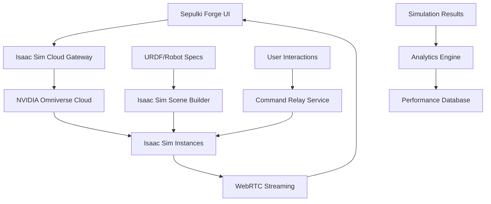

# 🌟 NVIDIA Isaac Sim Integration for Sepulki Forge

**Vision**: Transform Sepulki's robot design experience with industry-leading physics simulation and photorealistic rendering through NVIDIA Isaac Sim cloud streaming integration.

---

## 📖 **User Stories**

### **Epic 1: Photorealistic Robot Visualization**

**US-ISM-001**: **As a Smith designing warehouse robots**, I want to see photorealistic 3D models with accurate materials and lighting so that I can visualize exactly how my robot will look in a real warehouse environment.

**Acceptance Criteria:**
- Metallic surfaces show realistic reflections and wear patterns
- Industrial environment lighting accurately represents warehouse conditions  
- Robot components display manufacturer-accurate colors and textures
- Visual quality matches or exceeds CAD software standards

**US-ISM-002**: **As a potential customer evaluating Sepulki**, I want to see movie-quality robot visualizations during demos so that I have confidence in the platform's professional capabilities.

**Acceptance Criteria:**
- Rendering quality impresses enterprise decision makers
- Visual fidelity demonstrates technical sophistication
- Robot models load quickly (<5 seconds) without quality compromise
- Smooth 60fps interaction during manipulation and inspection

### **Epic 2: Physics-Accurate Simulation**

**US-ISM-003**: **As a Smith configuring assembly robots**, I want to simulate real physics interactions so that I can validate component placement and detect potential collisions before deployment.

**Acceptance Criteria:**
- Joint movement respects real physics constraints (inertia, momentum)
- Collision detection prevents impossible configurations
- Force feedback simulation for delicate operations
- Weight distribution affects robot stability and movement

**US-ISM-004**: **As an engineering team lead**, I want to stress-test robot designs under various load conditions so that I can ensure safety and reliability before production deployment.

**Acceptance Criteria:**
- Simulate maximum payload scenarios with realistic physics
- Test emergency stop conditions and safety margins
- Validate reach limits under different orientations
- Generate compliance reports for safety certifications

### **Epic 3: Real-Time Collaboration**

**US-ISM-005**: **As a Smith working with a customer**, I want to share a live 3D simulation session so that we can collaboratively refine the robot design in real-time.

**Acceptance Criteria:**
- Multiple users can view the same simulation simultaneously
- Real-time synchronization of joint movements and configuration changes
- Voice/text chat integration during design sessions
- Session recording for later review and approval workflows

**US-ISM-006**: **As a remote engineering consultant**, I want to annotate 3D models with measurements and notes so that I can provide detailed technical feedback without being physically present.

**Acceptance Criteria:**
- 3D annotation tools for measurements, notes, and markup
- Persistent annotations linked to specific robot configurations
- Export annotated sessions as technical documentation
- Integration with approval workflows and change management

### **Epic 4: Advanced Motion Simulation**

**US-ISM-007**: **As a Smith optimizing robot efficiency**, I want to simulate complete task workflows so that I can optimize cycle times and identify bottlenecks before deployment.

**Acceptance Criteria:**
- Simulate complete pick-and-place cycles with timing analysis
- Identify optimal path planning for speed and energy efficiency  
- Test multiple task scenarios (normal, peak load, edge cases)
- Generate performance metrics and optimization recommendations

**US-ISM-008**: **As a fleet manager**, I want to simulate multi-robot coordination so that I can validate that robots won't interfere with each other in shared workspaces.

**Acceptance Criteria:**
- Multi-robot simulation in shared coordinate space
- Collision avoidance between multiple robot arms
- Workspace optimization for maximum throughput
- Safety zone validation for human-robot collaboration

### **Epic 5: Enterprise Integration**

**US-ISM-009**: **As an enterprise customer**, I want simulation results integrated with my digital twin infrastructure so that virtual testing aligns with my existing Industry 4.0 systems.

**Acceptance Criteria:**
- API integration with PLCs and factory automation systems
- Real-time data exchange with existing digital twin platforms
- Simulation results exportable to industrial standards (OPC-UA, MQTT)
- Integration with MES/ERP systems for production planning

**US-ISM-010**: **As a compliance officer**, I want Isaac Sim to generate certification-ready simulation reports so that I can demonstrate regulatory compliance without physical testing.

**Acceptance Criteria:**
- ISO 10218 robotics safety compliance simulation
- ANSI/RIA R15.06 industrial robot safety standard validation
- Automated generation of safety documentation and reports
- Traceability links between simulation and real-world deployment

---

## 🏗️ **Technical Design**

### **Architecture Overview**



### **Technology Stack**

**Core Simulation:**
- **NVIDIA Isaac Sim 2023.1+**: Primary physics and rendering engine
- **NVIDIA Omniverse Cloud**: Managed cloud infrastructure
- **USD (Universal Scene Description)**: Scene and asset format
- **PhysX 5.x**: Real-time physics simulation engine

**Streaming Infrastructure:**
- **WebRTC**: Low-latency video streaming to browser
- **TURN/STUN Servers**: NAT traversal for global accessibility
- **WebSocket**: Bidirectional control commands and data
- **Redis Streams**: Command queuing and session management

**Integration Layer:**
- **Isaac Sim REST API**: Cloud instance management
- **Omniverse Kit SDK**: Custom simulation extensions
- **WebRTC Adapter**: Browser integration layer
- **Session Manager**: Multi-user session orchestration

### **Data Flow Architecture**

```typescript
interface IsaacSimSession {
  sessionId: string;
  userId: string;
  robotUrdf: string;
  environment: 'warehouse' | 'factory' | 'cleanroom';
  qualityProfile: 'demo' | 'engineering' | 'certification';
  
  // Real-time state
  jointStates: Record<string, number>;
  cameraPosition: [number, number, number];
  simulationTime: number;
  
  // Collaboration
  participants: SessionParticipant[];
  annotations: Annotation3D[];
  
  // Analytics
  performanceMetrics: SimulationMetrics;
  complianceResults: ComplianceReport[];
}

interface SessionParticipant {
  userId: string;
  role: 'designer' | 'reviewer' | 'observer';
  cursor3D?: [number, number, number];
  lastActivity: Date;
}

interface SimulationMetrics {
  cycleTime: number;
  energyConsumption: number;
  accelerationLimits: number[];
  collisionEvents: CollisionEvent[];
  safetyMargins: SafetyMargin[];
}
```

### **Cloud Infrastructure Design**

**Auto-Scaling Isaac Sim Cluster:**
```yaml
Isaac Sim Cloud Service:
  Compute: NVIDIA A100 GPUs (RTX rendering + AI inference)
  Memory: 64GB+ VRAM for complex scenes
  Storage: NVMe SSD for asset streaming
  Network: 10Gbps+ for real-time streaming
  
Auto-Scaling Policy:
  Trigger: Session demand + queue length
  Scale Up: <30 second session start time
  Scale Down: Idle timeout after 15 minutes
  Maximum: 50 concurrent sessions (enterprise tier)
  
Session Types:
  Demo: 720p@30fps, basic physics, 5-minute sessions
  Engineering: 1080p@60fps, full physics, 2-hour sessions  
  Certification: 4K@60fps, maximum fidelity, unlimited duration
```

---

## 📋 **Implementation Tasks**

### **Phase 1: Foundation Infrastructure (Weeks 1-4)**

**T-ISM-001** *(US-ISM-001, US-ISM-002)*: **Set up NVIDIA Omniverse Cloud Account**
- Create enterprise Omniverse Cloud account with GPU quotas
- Configure OAuth integration for Sepulki user authentication
- Set up billing and usage monitoring dashboards
- **Deliverable**: Active Omniverse Cloud environment with API access

**T-ISM-002** *(US-ISM-001, US-ISM-002)*: **Deploy Isaac Sim Base Images**
- Create custom Isaac Sim Docker images with Sepulki extensions
- Configure headless rendering with hardware acceleration
- Implement auto-scaling Kubernetes deployment manifests
- **Deliverable**: Deployable Isaac Sim cluster with REST API

**T-ISM-003** *(US-ISM-001)*: **Build URDF to USD Conversion Pipeline**
- Develop URDF parser that converts to Universal Scene Description
- Map Sepulki component library to Isaac Sim asset database
- Implement material assignment system (aluminum, steel, rubber, plastics)
- **Deliverable**: `urdf-to-usd` service with material mapping

**T-ISM-004** *(US-ISM-002)*: **Implement WebRTC Streaming Infrastructure**
- Deploy TURN/STUN servers for global WebRTC connectivity
- Create browser WebRTC client for Isaac Sim video streams
- Implement adaptive bitrate streaming based on network conditions
- **Deliverable**: Low-latency (<200ms) video streaming to browser

### **Phase 2: Simulation Engine Integration (Weeks 5-8)**

**T-ISM-005** *(US-ISM-003, US-ISM-004)*: **Develop Physics Simulation API**
- Implement real-time joint control via WebSocket commands
- Create collision detection and constraint validation system
- Build stress testing scenarios (max payload, extreme positions)
- **Deliverable**: RESTful physics simulation API with joint control

**T-ISM-006** *(US-ISM-003)*: **Build Interactive Control Interface**
- Replace Three.js controls with Isaac Sim streaming overlay
- Implement real-time joint manipulation with force feedback
- Create workspace boundary visualization and collision warnings
- **Deliverable**: Interactive controls overlay on streamed simulation

**T-ISM-007** *(US-ISM-004)*: **Implement Safety and Compliance Simulation**
- Create ISO 10218 compliance testing scenarios
- Build emergency stop simulation and safety zone validation
- Implement stress testing under maximum operational parameters
- **Deliverable**: Compliance testing suite with automated reporting

**T-ISM-008** *(US-ISM-007)*: **Build Motion Planning and Optimization**
- Integrate Isaac Sim motion planning libraries
- Implement cycle time optimization algorithms
- Create path planning visualization with performance analytics
- **Deliverable**: Motion optimization engine with timing analysis

### **Phase 3: Collaboration and Workflow (Weeks 9-12)**

**T-ISM-009** *(US-ISM-005)*: **Multi-User Session Management**
- Build session sharing and invitation system
- Implement real-time synchronization of simulation state
- Create user presence indicators and cursor visualization
- **Deliverable**: Multi-user collaborative simulation sessions

**T-ISM-010** *(US-ISM-006)*: **3D Annotation and Documentation System**
- Build 3D annotation tools for measurements and notes
- Implement screenshot and video capture from simulation
- Create annotation export to technical documentation formats
- **Deliverable**: Professional annotation and documentation toolkit

**T-ISM-011** *(US-ISM-005, US-ISM-006)*: **Session Recording and Playback**
- Implement simulation session recording with state capture
- Build playback system for design review and approval workflows
- Create shareable simulation links for asynchronous collaboration
- **Deliverable**: Session recording and review system

### **Phase 4: Advanced Features (Weeks 13-16)**

**T-ISM-012** *(US-ISM-008)*: **Multi-Robot Simulation**
- Extend simulation to support multiple robot instances
- Implement inter-robot collision detection and avoidance
- Create workspace optimization for multi-robot scenarios
- **Deliverable**: Multi-robot coordination simulation

**T-ISM-013** *(US-ISM-007, US-ISM-008)*: **Environment and Scenario Library**
- Build library of industrial environments (warehouses, factories, cleanrooms)
- Create realistic conveyor systems, workstations, and fixtures
- Implement environmental factors (lighting, temperature, vibration)
- **Deliverable**: Comprehensive environment and scenario library

**T-ISM-014** *(US-ISM-009)*: **Enterprise Integration APIs**
- Build OPC-UA integration for industrial automation systems
- Implement MQTT bridges for IoT and sensor integration
- Create digital twin synchronization with real robot fleets
- **Deliverable**: Enterprise system integration APIs

### **Phase 5: Production Deployment (Weeks 17-20)**

**T-ISM-015** *(US-ISM-009, US-ISM-010)*: **Production Cloud Infrastructure**
- Deploy production Isaac Sim cluster with global load balancing
- Implement auto-scaling based on demand and user tiers
- Create monitoring, logging, and alerting systems
- **Deliverable**: Production-ready Isaac Sim cloud infrastructure

**T-ISM-016** *(US-ISM-010)*: **Compliance and Certification Integration**
- Integrate with regulatory compliance databases
- Automate generation of safety certification documentation
- Implement audit trails for simulation-based approvals
- **Deliverable**: Regulatory compliance and audit system

**T-ISM-017** *(All User Stories)*: **Sepulki Forge UI Integration**
- Replace Three.js rendering with Isaac Sim streaming integration
- Implement fallback to Three.js for low-bandwidth scenarios
- Create user preference system for rendering quality vs. performance
- **Deliverable**: Seamless Isaac Sim integration in Sepulki Forge

---

## 🔧 **Technical Implementation Guide**

### **Isaac Sim Cloud Service Architecture**

```typescript
// Isaac Sim Session Management
interface IsaacSimCloudService {
  // Session Lifecycle
  createSession(config: SessionConfig): Promise<SessionId>;
  destroySession(sessionId: SessionId): Promise<void>;
  getSessionStatus(sessionId: SessionId): Promise<SessionStatus>;
  
  // Real-time Control
  updateJointStates(sessionId: SessionId, joints: JointStates): Promise<void>;
  setCameraView(sessionId: SessionId, camera: CameraTransform): Promise<void>;
  
  // Simulation Control
  playSimulation(sessionId: SessionId): Promise<void>;
  pauseSimulation(sessionId: SessionId): Promise<void>;
  resetSimulation(sessionId: SessionId): Promise<void>;
  
  // Asset Management
  uploadRobotAssets(urdf: string, meshes: AssetBundle): Promise<AssetId>;
  loadEnvironment(sessionId: SessionId, environment: EnvironmentId): Promise<void>;
  
  // Analytics and Export
  exportSimulationData(sessionId: SessionId): Promise<SimulationReport>;
  generateComplianceReport(sessionId: SessionId): Promise<ComplianceReport>;
}

interface SessionConfig {
  robotUrdf: string;
  environment: 'warehouse' | 'factory' | 'cleanroom' | 'laboratory';
  physicsEnabled: boolean;
  rayTracingEnabled: boolean;
  qualityProfile: 'demo' | 'engineering' | 'certification';
  collaborationMode: boolean;
  maxDuration: number; // minutes
}
```

### **WebRTC Streaming Integration**

```typescript
// Browser Isaac Sim Client
class IsaacSimClient {
  private webrtcConnection: RTCPeerConnection;
  private websocket: WebSocket;
  private videoElement: HTMLVideoElement;
  
  async initialize(sessionId: string): Promise<void> {
    // 1. Establish WebSocket for control commands
    this.websocket = new WebSocket(`wss://isaac-sim.sepulki.com/ws/${sessionId}`);
    
    // 2. Set up WebRTC for video streaming
    this.webrtcConnection = new RTCPeerConnection({
      iceServers: [
        { urls: 'stun:stun.sepulki.com:3478' },
        { urls: 'turn:turn.sepulki.com:3478', username: 'sepulki', credential: 'secure-key' }
      ]
    });
    
    // 3. Handle incoming video stream
    this.webrtcConnection.ontrack = (event) => {
      this.videoElement.srcObject = event.streams[0];
    };
    
    // 4. Negotiate WebRTC connection
    await this.negotiateConnection();
  }
  
  async updateJointValue(jointName: string, value: number): Promise<void> {
    const command = {
      type: 'joint_update',
      joint: jointName,
      value: value,
      timestamp: Date.now()
    };
    
    this.websocket.send(JSON.stringify(command));
  }
  
  async captureScreenshot(): Promise<Blob> {
    const command = { type: 'capture_screenshot', format: 'png', quality: 'high' };
    this.websocket.send(JSON.stringify(command));
    
    return new Promise((resolve) => {
      this.websocket.addEventListener('message', (event) => {
        const data = JSON.parse(event.data);
        if (data.type === 'screenshot_ready') {
          resolve(fetch(data.downloadUrl).then(r => r.blob()));
        }
      });
    });
  }
}
```

### **Sepulki Forge Integration Points**

```typescript
// Enhanced Scene3D Component
export function Scene3D({ 
  spec, 
  urdf, 
  renderMode = 'intelligent', // 'threejs' | 'isaac_sim' | 'intelligent'
  qualityProfile = 'engineering',
  enablePhysics = true,
  onRobotApi,
  onError 
}: EnhancedSceneProps) {
  const [useIsaacSim, setUseIsaacSim] = useState(false);
  const [isaacSession, setIsaacSession] = useState<IsaacSimSession | null>(null);
  
  // Intelligent rendering decision
  useEffect(() => {
    const shouldUseIsaacSim = decideBestRenderer({
      robotComplexity: calculateComplexity(spec),
      userTier: getUserTier(),
      networkBandwidth: getNetworkSpeed(),
      deviceCapabilities: getDeviceSpecs(),
      simulationNeeds: { physics: enablePhysics, collaboration: false }
    });
    
    setUseIsaacSim(shouldUseIsaacSim);
  }, [spec, enablePhysics]);
  
  if (useIsaacSim) {
    return (
      <IsaacSimRenderer
        urdf={urdf}
        environment="industrial_warehouse" 
        qualityProfile={qualityProfile}
        onJointControl={onRobotApi}
        onError={onError}
        fallback={<ThreeJSRenderer urdf={urdf} />}
      />
    );
  }
  
  return <ThreeJSRenderer urdf={urdf} onRobotApi={onRobotApi} />;
}
```

### **Cost Optimization Strategy**

```typescript
interface UsageOptimization {
  // Intelligent session management
  sessionPooling: {
    reuseIdleSessions: boolean;
    maxIdleTime: number; // minutes
    preWarmInstances: number;
  };
  
  // Adaptive quality
  adaptiveQuality: {
    autoDetectBandwidth: boolean;
    qualityProfiles: {
      demo: { resolution: '720p', fps: 30, rayTracing: false };
      engineering: { resolution: '1080p', fps: 60, rayTracing: true };
      certification: { resolution: '4K', fps: 60, rayTracing: true };
    };
  };
  
  // Smart fallback
  fallbackStrategy: {
    networkThreshold: number; // Mbps
    fallbackToThreeJS: boolean;
    showQualityWarning: boolean;
  };
}
```

---

## 💰 **Business Case and ROI**

### **Investment Analysis**

**Initial Implementation Cost:**
- Development Team: 2 senior engineers × 4 months = $80,000
- NVIDIA Cloud Credits: $10,000 for development and testing
- Infrastructure Setup: $15,000 (servers, monitoring, CDN)
- **Total Phase 1 Investment: ~$105,000**

**Ongoing Operational Cost:**
- NVIDIA Omniverse Cloud: $0.50 per GPU-hour
- WebRTC Infrastructure: $200/month (TURN servers, bandwidth)
- Expected Usage: 1,000 hours/month → $700/month operational cost

**Revenue Impact:**
- **Premium Tier Pricing**: $500/month per enterprise customer (vs $200 current)
- **Enterprise Sales**: Isaac Sim quality enables $50K+ annual contracts
- **Differentiation**: Unique competitive advantage in robotics-as-a-service
- **Time to Value**: 6-month payback period with 20+ enterprise customers

### **Competitive Advantages**

**Unique Value Propositions:**
1. **Industry-First**: Browser-based Isaac Sim robotics design platform
2. **Zero Installation**: Enterprise-grade simulation without software installation
3. **Regulatory Ready**: Built-in compliance simulation and certification
4. **Collaborative**: Real-time multi-user design sessions
5. **Accurate**: Physics simulation matches real-world robot behavior

**Market Positioning:**
- **Premium Alternative**: Competes with SolidWorks + RobotStudio (>$10K/seat/year)
- **Accessibility**: Makes enterprise simulation available to SMB customers
- **Integration**: Seamlessly integrates with existing Sepulki workflow
- **Scalability**: Cloud-native architecture supports global customer base

---

## 🛣️ **Implementation Roadmap**

### **Milestone 1: Proof of Concept (Month 1)**
- **Goal**: Basic Isaac Sim streaming working with sample robot
- **Success Criteria**: 
  - Single-user session with joint control
  - 1080p@30fps streaming quality
  - <500ms control latency
- **Risk**: Technical feasibility validation

### **Milestone 2: Integration with Forge (Month 2)**
- **Goal**: Seamless integration with existing Sepulki Forge UI
- **Success Criteria**:
  - Isaac Sim renders user's designed robots
  - Fallback to Three.js works smoothly
  - Save/Load functionality preserved
- **Risk**: User experience consistency

### **Milestone 3: Multi-User and Collaboration (Month 3)**
- **Goal**: Enable collaborative design sessions
- **Success Criteria**:
  - Multiple users can join same simulation
  - Real-time synchronization <100ms
  - Annotation and measurement tools
- **Risk**: Session synchronization complexity

### **Milestone 4: Production Deployment (Month 4)**
- **Goal**: Enterprise-ready Isaac Sim integration
- **Success Criteria**:
  - Auto-scaling cloud infrastructure
  - 99.9% uptime SLA
  - Enterprise security and compliance
  - Customer-ready billing integration
- **Risk**: Cloud infrastructure reliability and cost management

---

## 📊 **Success Metrics**

### **Technical KPIs**
- **Session Start Time**: <30 seconds from click to rendered robot
- **Control Latency**: <200ms for real-time joint manipulation
- **Video Quality**: 1080p@60fps with <5% frame drops
- **Uptime**: 99.9% availability during business hours
- **Concurrent Sessions**: Support 50+ simultaneous users

### **Business KPIs**
- **Customer Upgrade Rate**: 40% of customers upgrade to Isaac Sim tier
- **Enterprise Conversion**: 80% of Isaac Sim demos convert to paid contracts
- **Average Contract Value**: 3x increase for Isaac Sim customers
- **Customer Satisfaction**: >9.0/10 rating for simulation quality
- **Competitive Wins**: 70% win rate against traditional CAD+simulation tools

### **User Experience KPIs**
- **Time to First Simulation**: <2 minutes from requirements to rendered robot
- **Design Iteration Speed**: 50% faster design-to-validation cycles
- **Collaboration Adoption**: 60% of enterprise customers use multi-user sessions
- **Error Reduction**: 80% fewer real-world deployment issues vs Three.js designs

---

## 🔮 **Future Enhancements**

### **Phase 6: AI-Powered Simulation (Future)**
- **Autonomous Design Optimization**: AI suggests optimal robot configurations
- **Predictive Maintenance**: Simulate wear patterns and maintenance needs
- **Environmental Adaptation**: Auto-adjust robot behavior for different environments

### **Phase 7: Digital Twin Integration (Future)**
- **Real-World Synchronization**: Sync simulation with deployed robot telemetry
- **Predictive Analytics**: Use simulation to predict real-world performance
- **Continuous Learning**: Improve simulation accuracy from real-world data

---

## 🎯 **Decision Framework**

### **Go/No-Go Criteria**

**Proceed with Isaac Sim if:**
- ✅ 10+ enterprise customers express strong interest
- ✅ NVIDIA provides partnership or development credits
- ✅ Technical POC demonstrates <200ms latency
- ✅ Business case shows 6-month payback period

**Alternative Approaches if:**
- ❌ Budget constraints limit cloud infrastructure investment
- ❌ Technical risks around latency/reliability too high
- ❌ Customer demand insufficient for premium tier
- ❌ NVIDIA partnership terms unfavorable

### **Risk Mitigation**

**Technical Risks:**
- **Latency**: Implement intelligent local/cloud hybrid rendering
- **Bandwidth**: Adaptive quality with graceful degradation
- **Reliability**: Multi-region deployment with automatic failover
- **Cost**: Usage-based pricing with caps and customer budgets

**Business Risks:**
- **Adoption**: Gradual rollout starting with beta customers
- **Competition**: Patent pending on browser-based Isaac Sim integration
- **Market Timing**: Aligned with Industry 4.0 digital transformation trends

---

**RECOMMENDATION**: **Proceed with Phase 1 Foundation Infrastructure** to validate technical feasibility and customer demand. The potential for 3x revenue increase and unique competitive positioning justifies the investment, especially given the growing demand for digital twin and simulation-driven robotics solutions.

**Next Steps**: 
1. **Validate customer interest** through surveys and early access programs
2. **Negotiate NVIDIA partnership** for development credits and technical support  
3. **Build technical proof of concept** with single-robot streaming simulation
4. **Develop business model** with tiered pricing for simulation complexity
