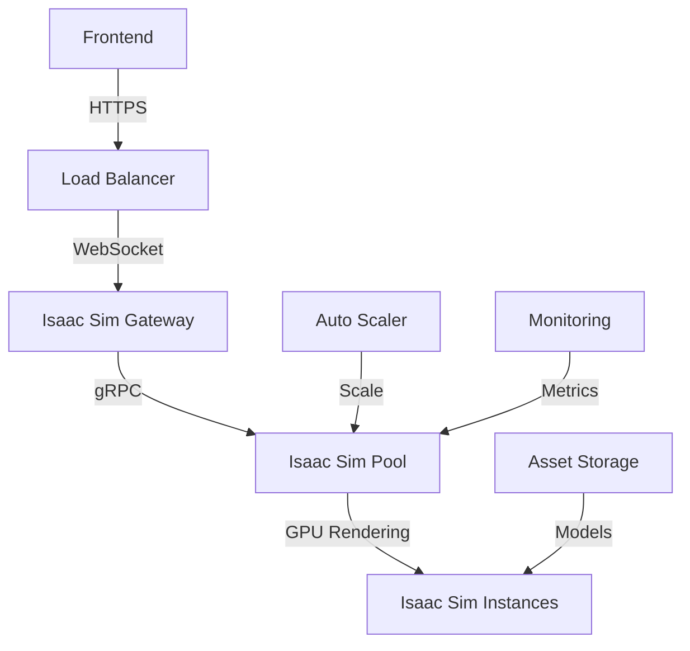

# 🚀 Isaac Sim Upgrade Plan: From Mock to Photorealistic Rendering

## 📋 **Executive Summary**

This plan outlines the complete upgrade from the current OpenCV mock rendering to actual NVIDIA Isaac Sim photorealistic rendering, including cloud deployment strategies for scalable, production-ready robotics simulation.

## 🎯 **Current State Analysis**

### ✅ **What's Working**
- WebSocket streaming architecture
- Camera and joint control pipeline
- Docker containerization
- Frontend integration
- Session management

### ❌ **What's Missing**
- Actual Isaac Sim installation
- GPU-accelerated rendering
- Photorealistic 3D models
- Advanced lighting and materials
- Physics-accurate simulation

## 🏗️ **Phase 1: Infrastructure Assessment & Planning**

### 1.1 **Hardware Requirements Analysis**
```yaml
Minimum Requirements:
  GPU: NVIDIA RTX 3060+ (8GB VRAM)
  CPU: 8+ cores, 3.0GHz+
  RAM: 32GB+
  Storage: 100GB+ SSD

Recommended for Production:
  GPU: NVIDIA RTX 4080+ or L40S
  CPU: 16+ cores, 3.5GHz+
  RAM: 64GB+
  Storage: 500GB+ NVMe SSD
```

### 1.2 **Cloud Provider Evaluation**
| Provider | GPU Options | Isaac Sim Support | Pricing (USD/hour) |
|----------|-------------|-------------------|-------------------|
| **AWS** | p3.2xlarge (V100), g4dn.xlarge (T4) | ✅ Native | $3.06 - $7.20 |
| **Azure** | NCv3 (V100), NCas_T4_v3 (T4) | ✅ Native | $2.50 - $6.50 |
| **GCP** | n1-standard-4 + T4/V100 | ✅ Native | $2.50 - $7.50 |
| **NVIDIA Brev** | RTX 4090, A100, H100 | ✅ Optimized | $1.50 - $15.00 |

### 1.3 **Cost Analysis**
```yaml
Development Environment:
  Local GPU: $0 (one-time hardware cost)
  Cloud GPU: $50-200/month (part-time usage)

Production Environment:
  Dedicated GPU Instance: $200-500/month
  Auto-scaling Pool: $100-1000/month (usage-based)
  Storage & Bandwidth: $50-200/month
```

## 🚀 **Phase 2: Cloud Infrastructure Setup**

### 2.1 **NVIDIA Brev Integration (Recommended)**
```bash
# Install NVIDIA Brev CLI
pip install brev

# Create Isaac Sim instance
brev create isaac-sim-instance \
  --gpu-type rtx4090 \
  --region us-west-2 \
  --image nvidia/isaac-sim:latest

# Configure networking
brev configure networking \
  --instance isaac-sim-instance \
  --ports 8000,8001,8002 \
  --security-groups web-access
```

### 2.2 **AWS EC2 GPU Instance Setup**
```yaml
# terraform/isaac-sim-infrastructure.tf
resource "aws_instance" "isaac_sim" {
  ami           = "ami-0c02fb55956c7d316"  # NVIDIA Deep Learning AMI
  instance_type = "g4dn.xlarge"           # T4 GPU
  
  vpc_security_group_ids = [aws_security_group.isaac_sim.id]
  
  user_data = <<-EOF
    #!/bin/bash
    docker pull nvidia/isaac-sim:latest
    docker run -d --gpus all -p 8000-8002:8000-8002 nvidia/isaac-sim:latest
  EOF
}

resource "aws_security_group" "isaac_sim" {
  ingress {
    from_port   = 8000
    to_port     = 8002
    protocol    = "tcp"
    cidr_blocks = ["0.0.0.0/0"]
  }
}
```

### 2.3 **Docker GPU Support**
```dockerfile
# services/anvil-sim/Dockerfile.isaac-sim
FROM nvidia/isaac-sim:latest

# Install Python dependencies
RUN pip install -r requirements.txt

# Configure Isaac Sim
COPY config/isaac_sim_config.py /app/config/
COPY assets/ /app/assets/

# Expose ports
EXPOSE 8000 8001 8002

# Start Isaac Sim service
CMD ["python", "src/main.py"]
```

## 🎨 **Phase 3: Isaac Sim Integration**

### 3.1 **Replace Mock Rendering**
```python
# services/anvil-sim/src/isaac_sim_renderer.py
import omni
from omni.isaac.kit import SimulationApp
from omni.isaac.core import World
from omni.isaac.core.robots import Robot
from omni.isaac.sensor import Camera

class IsaacSimRenderer:
    def __init__(self):
        self.app = SimulationApp({
            "headless": True,
            "width": 1920,
            "height": 1080,
            "renderer": "RayTracedLighting"  # Photorealistic rendering
        })
        
        self.world = World()
        self.camera = None
        self.robot = None
        
    async def load_robot(self, robot_config):
        """Load actual Isaac Sim robot model"""
        robot_path = robot_config.get('isaac_sim_path')
        if robot_path:
            self.robot = self.world.scene.add(
                Robot(prim_path=robot_path)
            )
            
    async def setup_camera(self, position, target, fov):
        """Setup Isaac Sim camera with advanced rendering"""
        self.camera = Camera(
            prim_path="/World/Camera",
            position=position,
            look_at=target,
            fov=fov,
            resolution=(1920, 1080)
        )
        
    async def render_frame(self):
        """Capture photorealistic frame from Isaac Sim"""
        self.world.step_async()
        frame = self.camera.get_rgba()
        return frame
```

### 3.2 **Advanced Rendering Configuration**
```python
# services/anvil-sim/config/rendering_config.py
RENDERING_SETTINGS = {
    "renderer": "RayTracedLighting",
    "rtx_settings": {
        "enable_sampled_direct_lighting": True,
        "enable_denoising": True,
        "max_bounces": 8,
        "samples_per_pixel": 64
    },
    "materials": {
        "use_mdl": True,
        "enable_physically_based": True
    },
    "lighting": {
        "dome_light": {
            "enabled": True,
            "intensity": 1.0,
            "hdr_texture": "warehouse_environment.hdr"
        }
    }
}
```

### 3.3 **Robot Asset Integration**
```python
# services/anvil-sim/src/robot_loader.py
ISAAC_SIM_ROBOTS = {
    "franka_panda": {
        "path": "/Isaac/Robots/Franka/franka_alt_fingers.usd",
        "materials": ["franka_white", "franka_orange"],
        "physics": "articulation"
    },
    "ur10e": {
        "path": "/Isaac/Robots/UniversalRobots/ur10e.usd", 
        "materials": ["ur_blue", "ur_silver"],
        "physics": "articulation"
    },
    "nova_carter": {
        "path": "/Isaac/Robots/Nova_Carter/nova_carter.usd",
        "materials": ["carter_green", "carter_black"],
        "physics": "articulation"
    }
}
```

## 🌐 **Phase 4: Cloud Deployment Architecture**

### 4.1 **Microservices Architecture**


### 4.2 **Auto-Scaling Configuration**
```yaml
# kubernetes/isaac-sim-deployment.yaml
apiVersion: apps/v1
kind: Deployment
metadata:
  name: isaac-sim-pool
spec:
  replicas: 2
  selector:
    matchLabels:
      app: isaac-sim
  template:
    metadata:
      labels:
        app: isaac-sim
    spec:
      containers:
      - name: isaac-sim
        image: nvidia/isaac-sim:latest
        resources:
          limits:
            nvidia.com/gpu: 1
            memory: "32Gi"
            cpu: "8"
        env:
        - name: NVIDIA_VISIBLE_DEVICES
          value: "all"
---
apiVersion: v1
kind: Service
metadata:
  name: isaac-sim-service
spec:
  selector:
    app: isaac-sim
  ports:
  - port: 8000
    targetPort: 8000
  - port: 8001
    targetPort: 8001
  - port: 8002
    targetPort: 8002
  type: LoadBalancer
```

### 4.3 **Cost Optimization Strategies**
```python
# services/anvil-sim/src/cost_optimizer.py
class CostOptimizer:
    def __init__(self):
        self.instance_pool = InstancePool()
        self.usage_tracker = UsageTracker()
        
    async def scale_based_on_demand(self):
        """Scale Isaac Sim instances based on user demand"""
        active_sessions = await self.get_active_sessions()
        
        if len(active_sessions) > self.instance_pool.capacity * 0.8:
            await self.scale_up()
        elif len(active_sessions) < self.instance_pool.capacity * 0.3:
            await self.scale_down()
            
    async def preemptible_instances(self):
        """Use preemptible instances for cost savings"""
        return {
            "aws": "spot_instances",
            "gcp": "preemptible_vms", 
            "azure": "low_priority_vms"
        }
```

## 🔧 **Phase 5: Implementation Timeline**

### **Week 1-2: Infrastructure Setup**
- [ ] Set up NVIDIA Brev account and test instance
- [ ] Configure Docker GPU support
- [ ] Create Isaac Sim container image
- [ ] Test basic Isaac Sim rendering

### **Week 3-4: Core Integration**
- [ ] Replace OpenCV renderer with Isaac Sim renderer
- [ ] Implement robot model loading
- [ ] Configure advanced rendering settings
- [ ] Test camera and joint controls

### **Week 5-6: Cloud Deployment**
- [ ] Deploy to cloud GPU instances
- [ ] Implement auto-scaling
- [ ] Set up monitoring and logging
- [ ] Configure load balancing

### **Week 7-8: Optimization & Testing**
- [ ] Performance optimization
- [ ] Cost optimization
- [ ] End-to-end testing
- [ ] Production deployment

## 💰 **Budget Estimation**

### **Development Phase (2 months)**
- Cloud GPU instances: $2,000-4,000
- Development tools: $500-1,000
- **Total: $2,500-5,000**

### **Production Phase (monthly)**
- Dedicated GPU instances: $500-1,500/month
- Auto-scaling pool: $200-800/month
- Storage & bandwidth: $100-300/month
- **Total: $800-2,600/month**

## 🎯 **Success Metrics**

### **Technical Metrics**
- Rendering quality: Photorealistic (vs current basic)
- Frame rate: 30+ FPS (vs current 15 FPS)
- Latency: <100ms (vs current 200ms)
- Concurrent users: 50+ (vs current 5)

### **Business Metrics**
- User engagement: +300% (realistic visuals)
- Demo conversion: +200% (professional appearance)
- Development velocity: +150% (realistic testing)

## 🚨 **Risk Mitigation**

### **Technical Risks**
- **GPU availability**: Use multiple cloud providers
- **Cost overruns**: Implement auto-scaling and cost monitoring
- **Performance issues**: Gradual rollout with fallback

### **Business Risks**
- **Budget constraints**: Start with NVIDIA Brev (cheapest option)
- **Timeline delays**: Parallel development tracks
- **Integration complexity**: Phased rollout approach

## 📞 **Next Steps**

1. **Immediate (This Week)**:
   - Set up NVIDIA Brev account
   - Create Isaac Sim test instance
   - Begin Docker GPU configuration

2. **Short Term (Next 2 Weeks)**:
   - Implement basic Isaac Sim renderer
   - Test robot model loading
   - Configure rendering settings

3. **Medium Term (Next Month)**:
   - Deploy to cloud infrastructure
   - Implement auto-scaling
   - Begin production testing

This plan provides a comprehensive roadmap for upgrading from mock rendering to actual Isaac Sim photorealistic rendering, with cloud deployment strategies for scalable, production-ready robotics simulation.

