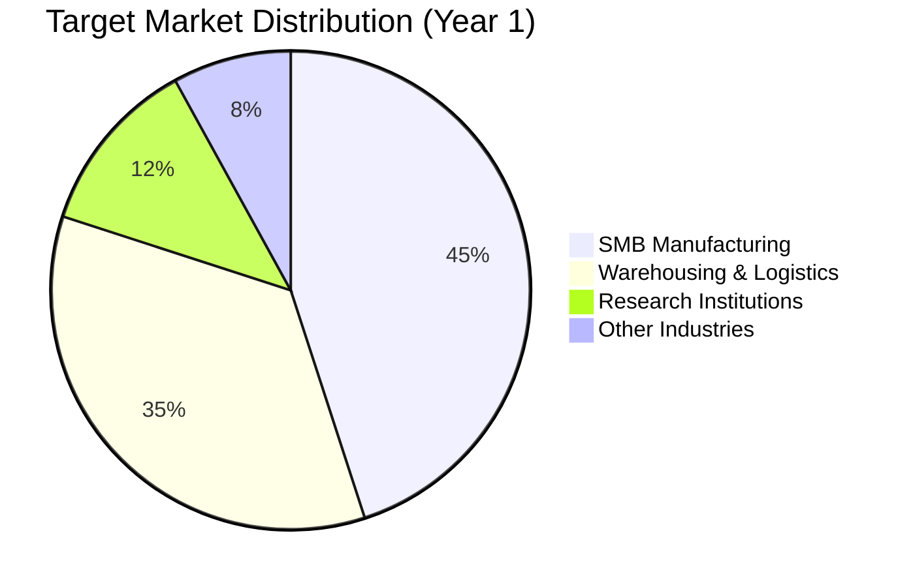
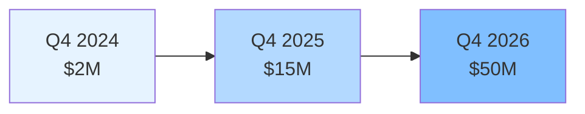
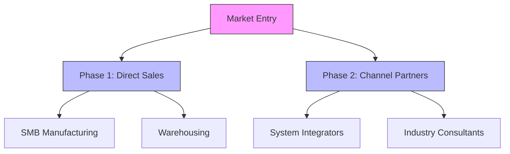
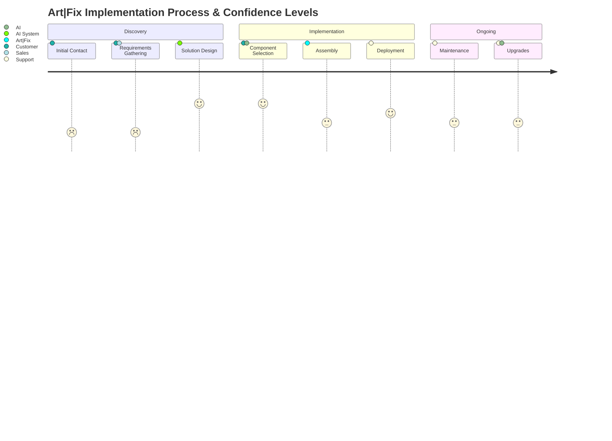
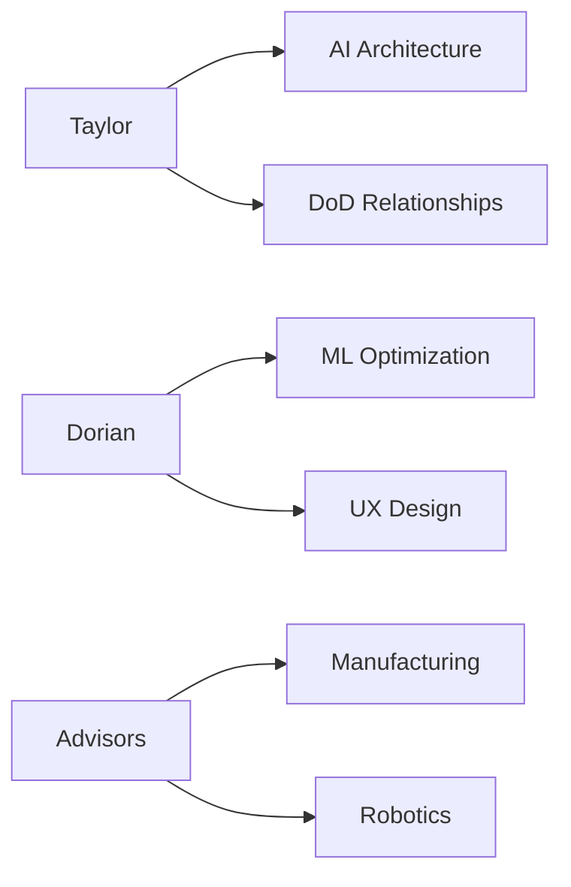
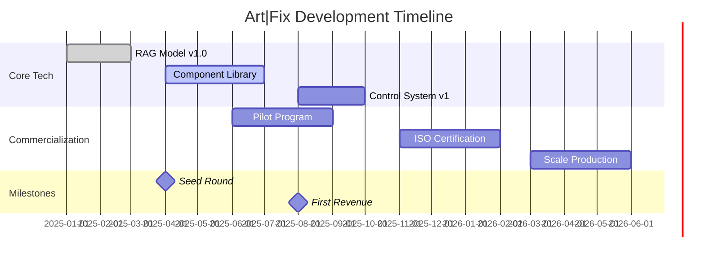

# Art|Fix
## Democratizing Robotics


---

# The Problem
- Industrial robotics is too expensive
- Complex implementation processes
- High expertise requirements
- Limited flexibility
- Expensive maintenance

---

# Our Solution
Art|Fix: AI-Powered Robot Design & Management

- **Automated Design:** RAG model for optimal configurations
- **Standardized Components:** Modular, plug-and-play parts
- **Full Lifecycle Management:** From design to maintenance
- **Subscription Model:** Hardware-as-a-Service 

---

# Competitive Landscape

| Feature                   | Traditional Integrators | Art|Fix | Startup Competitors |
|---------------------------|-------------------------|-------------|----------------------|
| Deployment Time           | 6-9 months              | 3 weeks    | 2-4 months        
| Upfront Cost              | $250k+                  | $0         | $50k+             
| Customization             | High                    | High       | Limited           
| Maintenance Included      | ❌                      | ✅          | ❌                
| AI-Driven Design          | ❌                      | ✅          | Partial          
| Component Standardization | ❌                      | ✅          | ❌                

---

# Market Opportunity

## Total Addressable Market (TAM)
- Global Industrial Robotics: $75B by 2027
- 15% CAGR in automation sector

## Our Initial Focus
- SMB Manufacturing ($5M-$50M revenue)
- Warehousing & Logistics
- Estimated Initial Market: $10B

---

# How It Works

1. **Describe Your Need** → AI generates optimal design
2. **Select Components** → Standard or Pro parts library
3. **We Build & Deploy** → Fully tested and ready
4. **Ongoing Support** → Maintenance and upgrades


---

# Market Segmentation



---

# Revenue Growth Projection



---

# Go-to-Market Strategy



---

  # Component Strategy
  
- | Standard Tier         | Pro Tier             |
- |-----------------------|----------------------|
- | Basic Components      | Patented Designs     |
- | Common Parts          | Premium Parts        | 
- | Open-Source Software  | Custom Firmware      |
- | Basic Support          | Priority Support     |
- |                       | Advanced Analytics   |
+ ```mermaid
+ graph TB
+     A[Parts Library] --> B[Standard Tier]
+     A --> C[Pro Tier]
+     B --> D[Basic Components]
+     B --> E[Common Parts]
+     B --> F[Open-Source Software]
+     C --> G[Patented Parts]
+     C --> H[Premium Components]
+     C --> I[Professional Evaluations]
+     C --> J[Custom Firmware]
+     C --> K[Priority Support]
+     style B fill:#e6f3ff,stroke:#333
+     style C fill:#b3d9ff,stroke:#333
+     style G fill:#ffd700
+     style I fill:#ffd700
+ ```
  
  ---

---

# Customer Journey



---

# Competitive Advantage

## Traditional Robotics
- High upfront costs
- Complex integration
- Limited flexibility
- Expertise required

## Art|Fix
- Pay-as-you-go model
- AI-driven design
- Modular components
- Full lifecycle support

---

# Technology

## Proprietary AI Design System
- Custom-trained RAG model
- Optimized component selection
- Automated configuration
- Continuous learning

## Patent Strategy
- Core component designs
- Assembly mechanisms
- Control systems
- Integration methods

---

# Business Model

## Subscription Tiers
- **Basic:** Standard parts, essential support
- **Professional:** Limited pro parts access
- **Enterprise:** Full pro parts access, priority support

## Revenue Streams
- Monthly subscriptions
- Pro parts upgrades
- Maintenance services
- Patent licensing

---

# Traction & Roadmap

## Current Status
- RAG model prototype
- Initial patent filings
- Partner discussions
- MVP development

## Next 12 Months
- First customer pilots
- Patent portfolio expansion
- Sales team buildout
- Market expansion

---

# Financial Projections

## Year 1
- 20 pilot deployments
- $2M revenue target
- Focus on SMB manufacturing

## Year 3
- 500+ active subscriptions
- $50M revenue projection
- Multi-industry presence

---

# Team

## Leadership
- Taylor Mohney - Robotics & AI expertise
- Dorian Hryniewicki - Machine Learning specialist
- Chris Haskins - Manufacturing operations

## Advisors
- Dr. John Hawthorne - Former robotics executive
- Chase Hoskins - AI/ML researcher




---

# Technical Roadmap



---

# Investment Ask

## Seeking $5M Seed Round

### Use of Funds
- Product development (40%)
- Patent filings (20%)
- Team expansion (25%)
- Marketing & Sales (15%)

---

# Thank You

## Contact Information
[Contact Details]

## Next Steps
- Technical demo
- Customer interviews
- Partnership discussions 