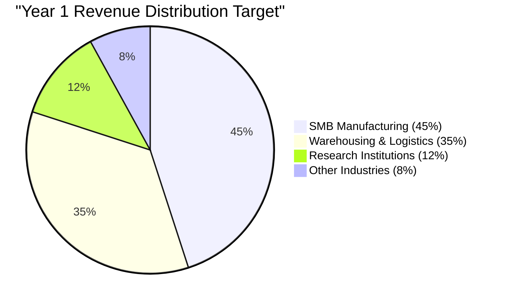
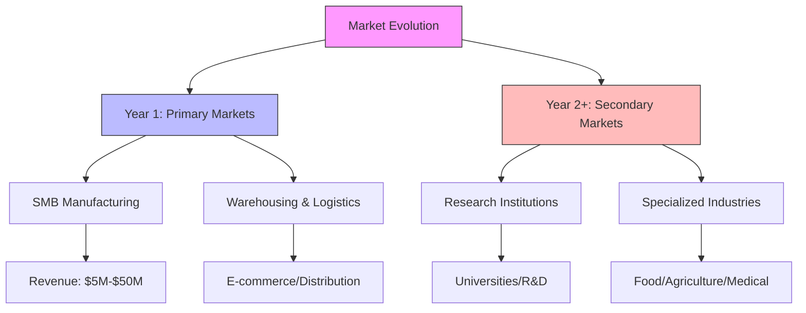
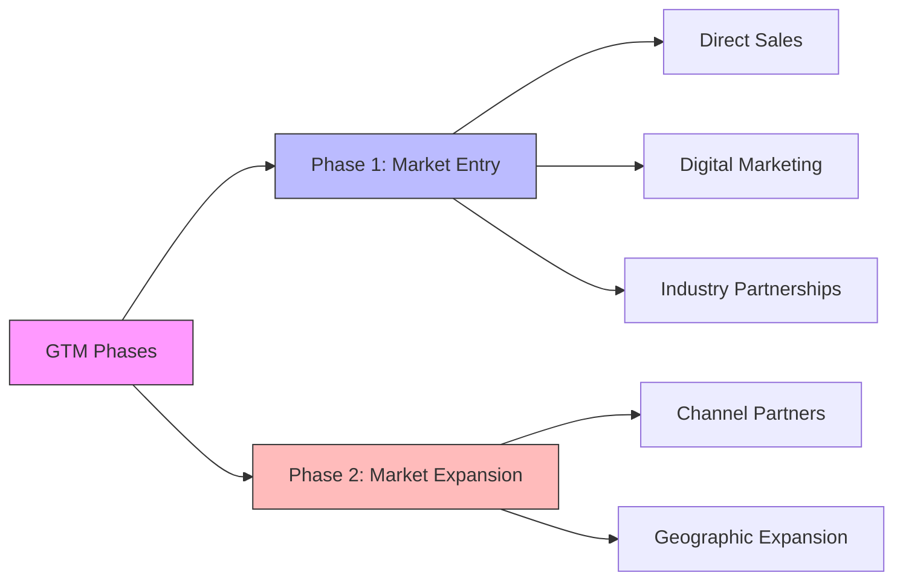
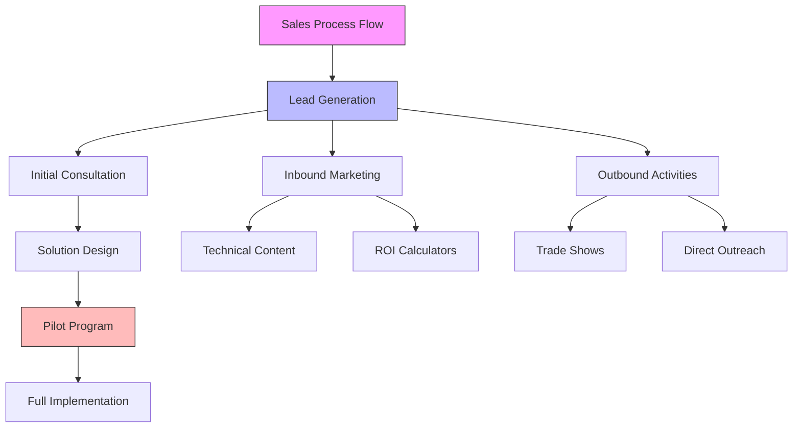
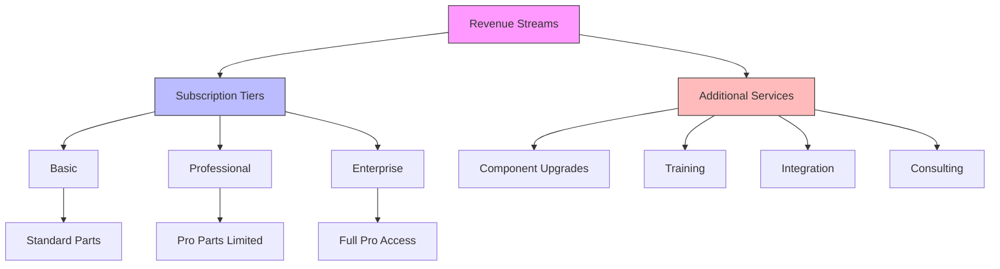
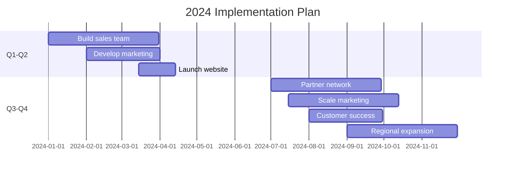

# Go-to-Market Strategy: Robo-tricks

## Target Market Segmentation

### Primary Markets (Year 1)
1. Small-to-Medium Manufacturing
   - Annual revenue: $5M-$50M
   - Current automation pain points
   - Limited robotics expertise
   - High labor costs

2. Warehousing & Logistics
   - E-commerce fulfillment centers
   - Distribution centers
   - 3PL providers
   - Small-scale warehouses

### Secondary Markets (Year 2+)
1. Research Institutions
   - Universities
   - R&D facilities
   - Innovation labs

2. Specialized Industries
   - Food processing
   - Agriculture
   - Medical facilities
   - Clean rooms

## Customer Acquisition Strategy

### Phase 1: Market Entry
1. Direct Sales
   - Industry-specific sales team
   - Technical sales engineers
   - Solution architects

2. Digital Marketing
   - Content marketing (case studies, whitepapers)
   - SEO optimization
   - LinkedIn/industry platform presence
   - Educational webinars

3. Industry Partnerships
   - Manufacturing associations
   - Industry consultants
   - Technology integrators
   - Regional economic development agencies

### Phase 2: Market Expansion
1. Channel Partners
   - System integrators
   - Manufacturing consultants
   - Equipment distributors
   - Industry-specific resellers

2. Geographic Expansion
   - Regional offices
   - Local support teams
   - International markets

## Sales Process

### Lead Generation
1. Inbound Marketing
   - Technical content
   - Industry use cases
   - ROI calculators
   - Design visualization tools

2. Outbound Activities
   - Trade shows
   - Industry conferences
   - Direct outreach
   - Partner referrals

## Pricing Strategy

### Component Tiers
1. Standard Parts Library
   - Basic actuators and sensors
   - Common structural components
   - Standard control systems
   - Basic end effectors
   - Non-proprietary components

2. Pro Parts Library
   - Patented component designs
   - Advanced sensors
   - High-performance actuators
   - Specialized end effectors
   - Premium materials
   - Proprietary control systems

### Subscription Tiers
1. Basic
   - Access to Standard Parts Library
   - Standard robot configuration
   - Basic maintenance
   - Remote monitoring
   - Business hours support

2. Professional
   - Limited access to Pro Parts Library
   - Advanced configurations
   - Priority maintenance
   - Performance optimization
   - 24/7 support

3. Enterprise
   - Full access to Pro Parts Library
   - Multiple robot fleet
   - Custom integrations
   - Dedicated support team
   - Advanced analytics
   - Priority access to new patented components

### Additional Revenue Streams
- Pro Parts Library upgrades
- Custom component upgrades
- Advanced training packages
- Integration services
- Consulting services
- Patent licensing for select partners

## Intellectual Property Strategy

### Patent Portfolio Development
1. Core Technologies
   - Novel component designs
   - Assembly mechanisms
   - Control systems
   - Integration methods
   - Specialized end effectors

2. Patent Timeline
   - Q1-Q2 2024: Initial patent filings for core components
   - Q3-Q4 2024: Secondary patent filings for improvements
   - 2025+: Continuous innovation and patent expansion

3. Patent Strategy
   - Defensive protection
   - Licensing opportunities
   - Market differentiation
   - Competitor barriers
   - Value creation

### IP Management
1. Internal Process
   - Innovation tracking
   - Regular patent reviews
   - R&D documentation
   - Trade secret protection

2. External Process
   - Patent monitoring
   - Competitor analysis
   - License management
   - Partnership agreements

## Marketing Strategy

### Content Marketing
1. Technical Content
   - Design process documentation
   - Implementation guides
   - Best practices
   - Case studies

2. Educational Content
   - Robotics basics
   - Automation strategies
   - Industry trends
   - ROI analysis

### Digital Presence
1. Website
   - Solution configurator
   - ROI calculator
   - Customer portal
   - Knowledge base

2. Social Media
   - LinkedIn focus
   - YouTube channel
   - Industry forums
   - Twitter updates

## Success Metrics

### Key Performance Indicators
1. Sales Metrics
   - Customer acquisition cost (CAC)
   - Lifetime value (LTV)
   - Sales cycle length
   - Conversion rates

2. Customer Success
   - Implementation time
   - Customer satisfaction
   - Robot uptime
   - Support resolution time

3. Financial Metrics
   - Monthly recurring revenue (MRR)
   - Gross margin
   - Customer churn
   - Expansion revenue

## Implementation Timeline

## Risk Mitigation

### Market Risks
- Competition response
- Market adoption rate
- Technology acceptance
- Economic conditions

### Operational Risks
- Supply chain management
- Service delivery capacity
- Technical support scaling
- Quality control

## Success Factors

1. Customer Focus
   - Strong customer success team
   - Regular feedback loops
   - Continuous improvement
   - Proactive support

2. Technical Excellence
   - Reliable robot performance
   - Quick deployment
   - Effective training
   - Robust support

3. Market Positioning
   - Clear value proposition
   - Competitive pricing
   - Strong brand presence
   - Industry expertise
