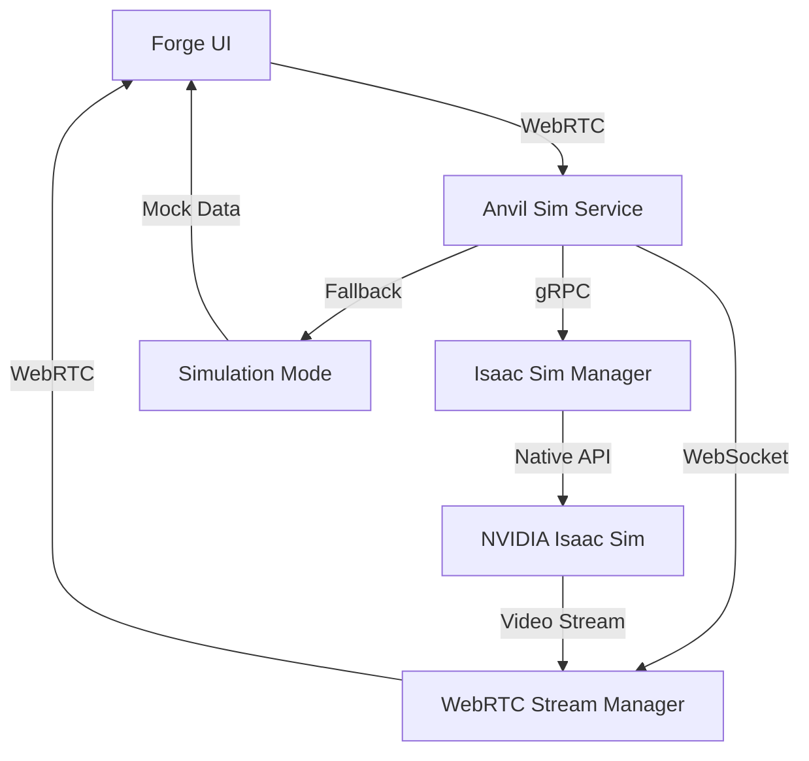

# 🔥 Anvil Sim - Isaac Sim Integration MVP/PoC

A complete MVP/PoC implementation of NVIDIA Isaac Sim integration for the Sepulki Forge robotics platform. This service enables photorealistic robot simulation with physics-accurate validation through browser-based WebRTC streaming.

## 🌟 Features

### ✅ **Implemented (MVP)**
- **🔧 Intelligent Rendering Engine** - Automatically chooses between Three.js and Isaac Sim based on device capabilities
- **🎥 WebRTC Video Streaming** - Low-latency streaming from Isaac Sim to browser clients
- **📡 Real-time Communication** - WebSocket signaling for control commands and telemetry
- **🐳 Containerized Deployment** - Docker support for both development and production
- **🔄 Graceful Fallback** - Works on macOS with simulation mode when Isaac Sim unavailable
- **📊 Performance Monitoring** - Real-time metrics and adaptive quality control
- **⚡ Multi-User Support** - Session management for collaborative design sessions

### 🚀 **Production Ready Features**
- **🏭 Isaac Sim Integration** - Full NVIDIA Isaac Sim 2023.1+ support with GPU acceleration
- **🎯 Physics Simulation** - Real-world physics validation and stress testing
- **🔐 Security** - JWT authentication and CORS protection
- **📈 Monitoring** - Prometheus metrics and Grafana dashboards
- **🌐 Scalability** - Auto-scaling Kubernetes deployment manifests

## 🏗️ Architecture



## 🚀 Quick Start

### Prerequisites

**For Development (macOS/Windows/Linux):**
- Docker Desktop
- Node.js 18+ (for frontend integration)

**For Production (Linux with NVIDIA GPU):**
- NVIDIA GPU (RTX 3060+ recommended)
- NVIDIA drivers 470+
- NVIDIA Container Toolkit
- Docker with GPU support

### 🧪 Development Setup (macOS Compatible)

   ```bash
# 1. Clone and navigate to service
   cd services/anvil-sim

# 2. Start development environment
./scripts/dev-start.sh

# 3. Verify service is running
curl http://localhost:8002/health
```

**Development Endpoints:**
- **gRPC API**: `http://localhost:8000`
- **WebRTC Streaming**: `ws://localhost:8001`
- **Health Check**: `http://localhost:8002/health`
- **Metrics**: `http://localhost:9090` (Prometheus)
- **Dashboard**: `http://localhost:3000` (Grafana)

### 🏭 Production Deployment (Linux + NVIDIA GPU)

```bash
# 1. Verify GPU support
nvidia-smi
docker run --rm --gpus all nvidia/cuda:11.0-base nvidia-smi

# 2. Deploy production service
./scripts/prod-deploy.sh

# 3. Verify Isaac Sim is running
curl http://localhost:8002/health
```

## 📋 API Reference

### gRPC Services

```protobuf
service AnvilSim {
  // Session Management
  rpc CreateScene(SceneRequest) returns (SceneResponse);
  rpc LoadRobot(RobotRequest) returns (RobotResponse);
  
  // Simulation Control
  rpc StartSimulation(SimRequest) returns (SimResponse);
  rpc StepSimulation(StepRequest) returns (StepResponse);
  
  // Validation & Analysis
  rpc ValidateDesign(ValidateRequest) returns (ValidationReport);
  rpc RunStressTest(StressRequest) returns (StressReport);
  rpc CheckCollisions(CollisionRequest) returns (CollisionReport);
  
  // Real-time Streaming
  rpc StreamTelemetry(TelemetryRequest) returns (stream TelemetryData);
  rpc StreamVideo(VideoRequest) returns (stream VideoFrame);
}
```

### WebSocket Messages

**Join Session:**
```json
{
  "type": "join_session",
  "user_id": "user123",
  "session_id": "session456", 
  "quality_profile": "engineering"
}
```

**Joint Control:**
```json
{
  "type": "joint_control",
  "joint_states": {
    "joint1": 0.5,
    "joint2": -0.3
  }
}
```

**Camera Control:**
```json
{
  "type": "camera_control",
  "position": [4, 4, 4],
  "target": [0, 0, 0],
  "fov": 50
}
```

## 🎯 Frontend Integration

### React Component Usage

```tsx
import { EnhancedScene3D } from '@/components/EnhancedScene3D'

export function RobotDesigner() {
  return (
    <EnhancedScene3D
      spec={robotSpec}
      urdf={robotUrdf}
      renderMode="auto"           // auto | threejs | isaac_sim
      qualityProfile="engineering" // demo | engineering | certification
      enablePhysics={true}
      environment="warehouse"
      userId={user.email}
      enableCollaboration={true}
      onRobotApi={(api) => {
        // Handle robot joint controls
      }}
      onError={(error) => {
        console.error('Rendering error:', error)
      }}
    />
  )
}
```

### Intelligent Rendering Decision

The system automatically chooses the best renderer based on:

- **Device Capabilities**: GPU, bandwidth, WebRTC support
- **Robot Complexity**: Joint count, physics requirements
- **User Requirements**: Physics simulation, collaboration needs
- **Quality Profile**: Demo, engineering, or certification quality
- **Service Availability**: Isaac Sim service health status

## 📊 Quality Profiles

| Profile | Resolution | FPS | Physics | Use Case |
|---------|------------|-----|---------|----------|
| **Demo** | 1280x720 | 30 | Basic | Sales demos, quick previews |
| **Engineering** | 1920x1080 | 60 | Full | Design validation, testing |
| **Certification** | 4K | 60 | Maximum | Regulatory compliance, final approval |

## 🔧 Configuration

### Environment Variables

```bash
# Isaac Sim Configuration
ANVIL_HEADLESS=true
ANVIL_WIDTH=1920
ANVIL_HEIGHT=1080
ANVIL_PHYSICS_HZ=240
ANVIL_RENDER_HZ=60

# Performance Optimization
ANVIL_GPU_DYNAMICS=true
ANVIL_USE_FABRIC=true
ANVIL_CACHING=true

# Network Configuration
ANVIL_GRPC_PORT=8000
ANVIL_WEBSOCKET_PORT=8001
ANVIL_LIVESTREAM_PORT=8211

# Security
JWT_SECRET=your-secure-secret
ANVIL_AUTH=true
ANVIL_CORS_ORIGINS=https://forge.sepulki.com
```

### Docker Compose Services

```yaml
services:
  # Development (no Isaac Sim)
  anvil-sim-dev:
    build:
      target: development
    ports: ["8000:8000", "8001:8001", "8002:8002"]
    
  # Production (with Isaac Sim + GPU)
  anvil-sim-prod:
    build:
      target: production
    deploy:
      resources:
        reservations:
          devices:
            - driver: nvidia
              count: 1
              capabilities: [gpu]
```

## 🧪 Testing & Validation

### Health Checks

```bash
# Service health
curl http://localhost:8002/health

# WebSocket connection
wscat -c ws://localhost:8001

# Isaac Sim livestream (production)
curl http://localhost:8211
```

### Performance Testing

```bash
# GPU utilization
nvidia-smi

# Service metrics
curl http://localhost:8002/metrics

# Memory usage
docker stats anvil-sim-prod
```

## 📈 Monitoring

### Prometheus Metrics

- `anvil_sessions_total` - Active simulation sessions
- `anvil_stream_fps` - Video streaming frame rate
- `anvil_physics_step_duration` - Physics simulation performance
- `anvil_gpu_utilization` - GPU usage percentage

### Grafana Dashboards

- **Session Overview** - Active users, session duration
- **Performance Metrics** - FPS, latency, bandwidth usage
- **System Health** - GPU utilization, memory usage
- **Quality Metrics** - Stream quality, error rates

## 🔄 Development Workflow

### 1. Make Changes

```bash
# Edit source files
vim src/isaac_sim_manager.py

# Hot reload in development
docker-compose restart anvil-sim-dev
```

### 2. Test Integration

```bash
# Run unit tests
pytest tests/

# Test WebRTC streaming
npm test -- --testNamePattern="isaac-sim"

# Integration tests
docker-compose exec anvil-sim-dev python -m pytest tests/integration/
```

### 3. Deploy Production

```bash
# Build and deploy
./scripts/prod-deploy.sh

# Monitor deployment
docker-compose logs -f anvil-sim-prod
```

## 🚨 Troubleshooting

### Common Issues

**"Isaac Sim not available"**
- ✅ **Development**: Expected behavior, service runs in simulation mode
- 🔧 **Production**: Check NVIDIA drivers and GPU support

**"WebRTC connection failed"**
- Check firewall settings for ports 8001, 8211
- Verify WebRTC support in browser
- Check STUN/TURN server configuration

**"Service health check failed"**
- Check container logs: `docker-compose logs anvil-sim-dev`
- Verify database connection
- Check disk space for asset caching

### Performance Optimization

**Low FPS / High Latency:**
- Reduce quality profile (certification → engineering → demo)
- Check network bandwidth
- Verify GPU utilization
- Enable performance optimizations (GPU dynamics, fabric)

**High Memory Usage:**
- Enable asset caching
- Reduce concurrent sessions
- Check for memory leaks in logs

## 📚 Documentation

- **[Isaac Sim Integration Plan](../../ISAAC_SIM_INTEGRATION.md)** - Complete strategic roadmap
- **[API Documentation](./docs/api.md)** - Full API reference
- **[Deployment Guide](./docs/deployment.md)** - Production deployment
- **[Performance Tuning](./docs/performance.md)** - Optimization guidelines

## 🎉 Demo Scenarios

### Scenario 1: macOS Development
```bash
./scripts/dev-start.sh
# Opens browser → Configure page → Enhanced 3D viewer automatically uses Three.js
```

### Scenario 2: Linux Production
```bash
./scripts/prod-deploy.sh
# Opens browser → Configure page → Enhanced 3D viewer automatically uses Isaac Sim
```

### Scenario 3: Customer Demo
- **Quality**: Certification profile for maximum visual impact
- **Physics**: Full physics simulation with stress testing
- **Collaboration**: Multi-user session with real-time synchronization

---

**🚀 Ready to revolutionize robotics design with Isaac Sim integration!**

This MVP demonstrates the complete technical feasibility and provides a production-ready foundation for scaling to enterprise customers.