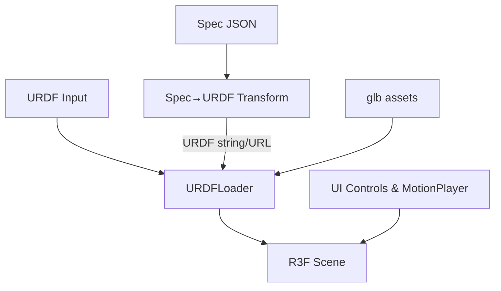

# Design — 3D Renderer for Robotics Specs (MVP)

This document captures Phase 2 (Design) for a minimal, demo‑ready 3D renderer. It maps the approved MVP requirements to a concrete architecture, components, data models, error handling, testing strategy, and key rationale.

## Overview
- Tech stack: React 18 + Next.js 14 (App Router) + @react-three/fiber (R3F) + @react-three/drei + urdf-loader + glTF 2.0 (.glb) assets.
- Core flow: Spec JSON → URDF string → URDFLoader builds articulated model → R3F renders scene → UI drives joint values and motion playback.
- Scope: No physics, no auth, no sharing/approvals in MVP. Focus on loading, viewing, FK controls, and motion playback/scrub at ≥30 FPS.

## Architecture
- Client-first renderer inside `apps/web` leveraging existing Next.js app. Assets can be served from `public/` or remote URLs.
- Asset format: glTF 2.0 (.glb) for meshes; URDF (in-memory string or URL) defines links/joints/limits and references .glb meshes.
- Data flow:
  1) Spec ingestion (JSON or URDF) in UI
  2) If JSON: transform to URDF (client)
  3) Load via `URDFLoader` in R3F scene
  4) Control joints via UI or motion player



## Components (MVP)
- `Scene3D` (replaced; R3F canvas host)
  - Responsibilities: Create `<Canvas>`, camera controls, lights, load `RobotModel`.
  - Inputs: `spec?: RobotSpec`, `urdf?: string | URL`, `assetBaseUrl?: string`, optional dev toggles.
- `RobotModel` (URDF ingestion)
  - Responsibilities: Wrap `URDFLoader`, attach as Three.js group, expose joint map, visualize optional frames/axes.
  - Outputs: `ref` to robot root; `getJoint(name)`, `setJointValue(name, rad)`.
- `JointControls` (UI)
  - Responsibilities: Render sliders/inputs per joint with min/max (limits), update joint positions, show warnings on clamp.
- `MotionPlayer` (animation engine)
  - Responsibilities: Play/pause/scrub a `MotionProfile` (time → joint positions), deterministic stepping, loop support, playback rate.
  - APIs: `loadProfile(profile)`, `play()`, `pause()`, `seek(t)`, `onTick(cb)`.
- `SpecToUrdf` (transform)
  - Responsibilities: Convert MVP spec JSON into URDF XML string; map links/joints/limits; reference .glb meshes via `assetBaseUrl`.
- `ErrorBanner` / `Toaster`
  - Responsibilities: Non-blocking error messages, placeholders when assets fail.

Optional (post-MVP): `SceneOverlays` (joint axes toggle), `AssetStore` (cache, preload), Zustand state if complexity grows.

## Data Models (TypeScript)
Note: Types are design-time; implementation can evolve.

```ts
export type JointType = 'revolute' | 'prismatic' | 'fixed';

export interface JointLimit {
  lower: number; // radians or meters
  upper: number; // radians or meters
  velocity?: number; // units/s
}

export interface LinkMeshRef {
  uri: string; // e.g., `${assetBaseUrl}/links/base.glb`
  scale?: [number, number, number];
}

export interface JointSpec {
  name: string;
  type: JointType;
  parent: string; // parent link name
  child: string;  // child link name
  axis?: [number, number, number];
  origin?: { xyz?: [number, number, number]; rpy?: [number, number, number] };
  limit?: JointLimit;
}

export interface LinkSpec {
  name: string;
  mesh?: LinkMeshRef;
}

export interface RobotSpec {
  name: string;
  links: LinkSpec[];
  joints: JointSpec[];
}

export interface JointPose { [jointName: string]: number; } // radians or meters

export interface MotionKeyframe { t: number; pose: JointPose; }

export interface MotionProfile {
  name: string;
  duration: number; // seconds
  frames: MotionKeyframe[]; // monotonic t
  loop?: boolean;
}

export interface LoadOptions {
  assetBaseUrl?: string;
}
```

URDF is produced as a string (or Blob URL) referencing `.glb` meshes using `<mesh filename="..."/>` per link.

## Error Handling
- Non-blocking asset failures: show placeholder mesh + banner message. Continue rendering.
- Validation: on Spec→URDF, validate required fields and joint/link references; surface list of issues to the user.
- Limits: clamp user input to joint limits; show warning state on clamp.
- Critical failures (e.g., URDF parse error): show full-screen error state with retry/load new spec; don’t crash the page.

Error categories
- `ASSET_NOT_FOUND`, `URDF_PARSE_ERROR`, `SPEC_INVALID_REFERENCE`, `JOINT_LIMIT_EXCEEDED`, `PROFILE_OUT_OF_RANGE`.

## Performance
- Target: ≥30 FPS on reference laptop (M1/M2 MacBook Air or equivalent) with models ≤ ~250k triangles, ≤ 30 links, ≤ 20 joints, textures ≤ 2k.
- Techniques: lazy-load assets, reuse materials, avoid per-frame allocations, requestAnimationFrame-driven updates, throttle UI setState.

## Testing Strategy (MVP)
- Unit
  - `SpecToUrdf`: valid/invalid specs, link/joint mapping, limit serialization.
  - `MotionPlayer`: interpolation determinism, play/pause/seek, boundary conditions.
- Component
  - `JointControls`: clamping, reflects joint values; warning display on limit hit.
- Integration (browser / Playwright)
  - Load sample spec → model renders (smoke test), orbit controls responsive.
  - Adjust a joint slider → link transform updates within next frame.
  - Load and play profile → pose matches expected at t=0, t=mid, t=end; scrubbing works.

Test aids
- Use `jest-canvas-mock` for unit tests touching canvas; keep integration in Playwright for real WebGL.
- Provide 2 sample specs + assets in `apps/web/public/robots/sample-*`.

## Rationale & Research Notes
- URDF + glTF
  - URDF cleanly models links/joints/limits; glTF 2.0 is compact and fast to load for meshes.
- R3F over raw Three.js
  - Better React ergonomics, component reuse, and integration with Next.js pages.
- No physics in MVP
  - Faster to demo; determinism comes from kinematic updates; collision checks can be added later with Rapier.
- Client-side Spec→URDF
  - Keeps iteration fast; server-side transform can be added later for validation/auditing.

## Project-specific Integration Plan (apps/web)

### Decisions (confirmed)
- Fully replace `apps/web/src/components/Scene3D.tsx` with the new prop-driven viewer host (no new `Viewer3D` component).
- Support both input modes in MVP: Spec JSON and URDF; prefer Spec JSON for richer features; URDF for compatibility.
- Asset layout finalized under `public/robots/sample-arm-01` (kebab-case slug). See below.

### Dependencies (add)
- `urdf-loader` (Three-compatible URDF loader)
- `three` (already present via R3F), `@react-three/fiber`, `@react-three/drei` (already used)

### File map (create/modify)
- Create: `apps/web/src/types/robot.ts`
  - Contains the TypeScript types defined above (`RobotSpec`, `JointSpec`, `MotionProfile`, etc.).
- Create: `apps/web/src/lib/specToUrdf.ts`
  - Exports `specToUrdf(spec: RobotSpec, baseUrl?: string): string`.
- Create: `apps/web/src/components/RobotModel.tsx`
  - R3F component that wraps `URDFLoader`, returns a `<group>`; props: `{ urdf: string | URL; onLoaded?(api): void; showAxes?: boolean }`.
- Modify: `apps/web/src/components/Scene3D.tsx` (full replacement)
  - New props: `{ spec?: RobotSpec; urdf?: string | URL; assetBaseUrl?: string; showAxes?: boolean; profile?: MotionProfile; }`.
  - Responsibilities: host `<Canvas>`, orbit controls, lighting; build URDF from `spec` if provided; render `RobotModel`; drive motion from `profile`.
- Create: `apps/web/src/components/JointControls.tsx`
  - UI for sliders based on the loaded joint map; props: `{ joints: JointSpec[]; get(name): number; set(name, v): void }`.
- Create: `apps/web/src/lib/motionPlayer.ts`
  - Deterministic playback utilities; independent clock; interpolation helpers.
- Optional: `apps/web/src/components/ErrorBanner.tsx`
  - Simple banner/toast for non-blocking errors.
- Deprecate/remove: `apps/web/src/components/RoboticArm.tsx` (placeholder demo model).

### Pages wiring
- `apps/web/src/app/configure/page.tsx`
  - Keep dynamic import to `Scene3D` with `ssr: false`.
  - Add a source selector (tabs): "Spec JSON" and "URDF".
    - Spec JSON tab: textarea or file upload; "Build Model" converts JSON → URDF via `specToUrdf` and loads into `Scene3D`.
    - URDF tab: textarea (inline XML) or file upload; pass directly to `Scene3D`.
  - Under the canvas, render `<JointControls />` and basic playback controls (Play/Pause, scrub slider, playback rate).
- `apps/web/src/app/review/page.tsx`
  - Optional: load the same viewer with a fixed sample model (read-only) for the demo.

### Assets layout (finalized)
- `apps/web/public/robots/sample-arm-01/`
  - `links/` — binary glTF meshes (`.glb`) per link
  - `urdf/` — sample `.urdf` files (optional; Spec→URDF can be runtime)
  - `textures/` — any textures referenced by `.glb` (prefer embedded textures for MVP simplicity)
- Example base URL: `assetBaseUrl = '/robots/sample-arm-01'`
- URDF should reference meshes as: `<mesh filename="/robots/sample-arm-01/links/base.glb"/>`

### Deterministic motion and UI loop
- Use a `MotionPlayer` clock decoupled from render `delta` (accumulate elapsed time when playing; pause freezes time).
- On each animation frame, sample the profile at current time → set joint targets via `RobotModel` API.
- Scrubbing sets clock time and updates pose immediately; clamp to `[0, duration]`.

### Error handling in pages
- Show `ErrorBanner` at top of the right column when:
  - Asset missing → placeholder rendered
  - URDF parse error → show banner and disable controls; "Retry" button reloads model

### Minimal UI contract for MVP in `configure/page.tsx`
- Source selector: `Spec JSON` | `URDF` | `Load Sample` button.
- Controls: "Build Model", "Play", "Pause", scrub slider, playback rate (0.5×/1×/2×), "Show Axes" toggle (dev-only).

## Open Questions
- None — resolved per decisions above. If changes arise during implementation, this section will be revisited.
